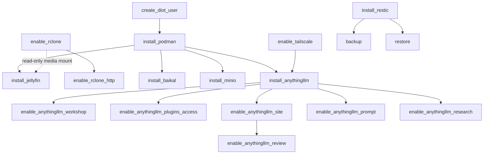

# strata

A small Ansible config manager for provisioning a personal Linux machine. Playbooks do the work; a thin Python layer (`ansible-runner` plus a `strata` CLI) wraps them so that prerequisites -- sudo passwords, vault secrets, SSH keys, system users, data directories -- are resolved declaratively before a playbook runs, prompting only when something is genuinely missing.

The managed host defaults to the local machine itself (`ansible_connection=local`), so the controller and the target are usually the same box -- which is why interactive prompts (vault password, rclone authorization) work directly during a run. Additional machines can be registered with `strata device add` and targeted with `--target <hostname>`.

## Layout

The package is a three-layer scaffold, and an import-linter contract enforces it: `cli`, `adapters` and `core` are the only top-level packages, and imports may only point downward (`cli` -> `adapters` -> `core`).

- `strata/cli/` -- the `strata` CLI entrypoint (Typer) and the composition root: `main.py` assembles the app tree, `commands/` holds one module per command group, `dispatch.py` resolves and runs a runbook.
- `strata/core/` -- runbooks, models, guards, and the `Protocol` ports adapters satisfy. No I/O. `core/runbooks/` is grouped by category (`system/`, `package_managers/`, `development/`, `infrastructure/`, `services/`); each module exposes `main(target, *, runner)` and an optional `check()`, decorated with guards that *declare* requirements rather than satisfying them.
- `strata/adapters/` -- everything that touches the outside world: `guard_executor.py` (satisfies what the guards declared, then calls `main()`), `ansible/` (runner, vault secrets, host_vars/group_vars, SSH keys, rclone, inventory), `proc.py`, `state.py`, `fs.py`.
- `ansible/playbooks/` -- the actual playbooks. Paths resolve relative to `ansible/`, independent of where the runbook module lives.
- `ansible/inventory/host_vars/<host>.yml` -- per-host plain (unencrypted) variables, e.g. rclone remotes and published SSH keys. `ansible/inventory/group_vars/all/server_apps_defaults.yml` -- shared server-app defaults. `ansible/inventory/group_vars/secrets/all.yml` -- vault-encrypted secrets (gitignored).

`docs/ARCHITECTURE.md` is the full structural reference -- the layer scaffold, the guard flow, the call chain from CLI to playbook, and the conventions a change is expected to hold to. `docs/LEDGER.md` records known asymmetries and refactor opportunities.

## Getting started

Bootstrap installs Python, pipx, uv, and the project dependencies using only the standard library:

```bash
python bootstrap.py
```

After that, everything runs through uv:

```bash
uv sync
uv run strata --help
```

The inventory is not shipped with the repository -- it names your own machines, addresses and accounts. Start from the template and edit it for your setup:

```bash
cp ansible/inventory/hosts.ini.example ansible/inventory/hosts.ini
```

The vault password is stored once in the OS keychain and reused for every encrypted secret:

```bash
uv run strata config vault-password
```

## The `strata` CLI

- `strata config var NAME [--value V]` -- set a plain variable in `group_vars/all/managed.yml`.
- `strata config secret NAME [--value V]` -- vault-encrypt a secret into `group_vars/secrets/all.yml`.
- `strata config vault-password` -- store or reset the vault master password in the keychain.
- `strata config key LABEL` -- generate an SSH keypair at `~/.ssh/<label>` and publish its public half as the `<label>_authorized_key` group var.
- `strata rclone add NAME` / `strata rclone list` / `strata rclone remove NAME` -- register rclone remotes for auto-mounting (see below).
- `strata rclone serve add NAME PATH --port PORT` / `strata rclone serve list` / `strata rclone serve remove NAME` -- register an rclone path to be served over local HTTP instead of mounted (see "Serving rclone paths over local HTTP" below).
- `strata rclone sync add NAME` / `strata rclone sync list` / `strata rclone sync remove NAME` -- register a remote whose credentials `infrastructure.sync_rclone_remote` copies onto a target host.
- `strata device add NAME --host ADDR` / `strata device list` / `strata device show NAME` / `strata device remove NAME` -- manage remote hosts in the `[remote]` group of `hosts.ini`, which `--target` then addresses.
- `strata runbook NAME [--target HOST]` -- run a runbook, e.g. `strata runbook services.install_jellyfin`. Omit NAME on a terminal for a type-ahead picker over every runbook, matching anywhere in the name and showing each one-line summary alongside it; omit `--target` and you are asked which host, defaulting to the last one used so Enter reuses it. Ctrl-C aborts either. `strata runbook --list` browses them as plain text instead. Piped and scripted invocations never prompt: without NAME they error, and without `--target` they fall back to the stored target.
- `strata gui [--port PORT] [--allow-origin ORIGIN]` -- serve the runbook catalog and action API on loopback for the Flutter app, which lives in its own repository. Prints the URL and the bearer token the mutating routes require. It serves no web app.

## Guards

Guards are decorators on a runbook's `main()` that make a prerequisite hold before the body runs. They share one idea: a cheap local check, and only if it fails, do the privileged work (usually by running a small playbook).

- `@guard.prerequisite("sudo_password")` -- ensure a registered prerequisite (the vaulted sudo password) is present.
- `@guard.secret(vault_key, ...)` -- ensure a vault secret exists, prompting (and optionally generating) if absent.
- `@guard.user(name, playbook)` -- ensure a system user exists, running `playbook` to create it if not.
- `@guard.path(path, owner=, group=, mode=)` -- ensure a local filesystem path exists with the given ownership and mode, delegating to `ensure_path.yml`.
- `@guard.mount(remote:subpath)` -- ensure an rclone remote is registered and its mount point is live (creating the remote interactively if missing), running `enable_rclone.yml` if not.
- `@guard.storage(vault_key, owner=, group=, mode=, require_writable=)` -- ensure a vaulted storage location -- prompted for like `@guard.secret` -- is ready, dispatching to the `@guard.path` or `@guard.mount` flow at runtime depending on whether the stored value is a local path or a `remote:subpath`.
- `@guard.requires("category.runbook")` -- ensure an upstream runbook has run first.
- `@guard.controller_only(reason)` -- refuse a non-controller target outright, for workstation tooling whose playbook is deliberately `hosts: local`. Without it such a play matches no hosts under `--limit`, which ansible reports as success.
- `@guard.backup_tag(tag, path)` -- declare that `path` is snapshotted under restic tag `tag`; `infrastructure.backup` collects these by importing every runbook.
- `@guard.alias(display_name)` -- the friendly name shown in `--list` and the picker. Metadata only; a runbook is still invoked by its dotted or leaf name.

## System and package managers

These runbooks are simpler and independent of each other (no dependency chain), so they're listed flat rather than diagrammed:

- `system.enable_security_autoupdates` -- enable automatic security updates via unattended-upgrades.
- `package_managers.install_flatpak` -- install Flatpak and add the Flathub remote.
- `package_managers.install_homebrew` -- install Homebrew and core dev tools (node, pipx, uv, openjdk, rust). It installs to `/home/linuxbrew/.linuxbrew` and adds that prefix to no profile and no PATH, so invoke `brew` by its full path or put the prefix on your own PATH.
- `development.install_antigravity` -- install Google Antigravity CLI via the local Homebrew tap.
- `system.enable_crash_recovery` -- recover from kernel panics/freezes and keep crash evidence readable.
- `infrastructure.enable_tailscale` -- join this host to the Tailscale tailnet for off-LAN reachability.
- `infrastructure.enable_wireguard` -- route all of this host's traffic through a WireGuard VPN (any provider) while Tailscale keeps working. The prompted key belongs to one host at a time, and inbound router port-forwards to this host stop working while the tunnel is up.
- `infrastructure.install_restic` -- initialize the restic repository that `backup`/`restore` use.
- `infrastructure.backup` / `infrastructure.restore` -- snapshot each opted-in app's data under its own restic tag, and write the latest snapshot per tag back. Both accept `--tags` to narrow the set.
- `infrastructure.sync_rclone_remote` -- copy registered rclone remote credentials onto a target host.
- `services.install_from_git` -- install CLI apps from local git repos via pipx, driven by a hand-edited list in `static/git_apps.toml`. Runs `pipx install <repo>` for each listed app (uninstall first for a clean rebuild every run). Guarded by `@guard.requires("package_managers.install_homebrew")` since homebrew provides pipx. With an empty list it reports itself not installed, then runs, says there is nothing to install, and exits 0.

## Server apps

Server apps run as rootless Podman containers owned by a dedicated `diot` user (a container operator with a subuid/subgid range and systemd lingering, so its `--user` services persist without a login). Each container is a Quadlet unit under `~diot/.config/containers/systemd/`, which systemd turns into a managed service.

The dependency chain is enforced by guards, so running a leaf runbook pulls in everything beneath it:



- `install_podman` -- Podman and the rootless toolchain; ensures `diot` via `create_diot_user`. That account is reconciled on every server-app run, even when podman is already installed: a passwd entry is no evidence that its subuid range, subgid range and lingering survived, and those are what rootless containers actually need.
- `enable_rclone` -- install rclone and mount configured remotes (see below).
- `enable_rclone_http` -- serve registered rclone paths over local HTTP instead of mounting them (see "Serving rclone paths over local HTTP" below).
- `install_jellyfin` -- Jellyfin media server on port 8096; config and cache at `/srv/jellyfin/{config,cache}` (`diot:jellyfin`, setgid), with the read-only media library bound from `/mnt/rclone/pcloud/Media`.
- `install_baikal` -- Baikal CalDAV/CardDAV server on port 8080; data at `/srv/baikal/{config,Specific}` (`diot:baikal`, setgid).
- `install_anythingllm` -- AnythingLLM document-chat server on port 3001, published on loopback only and served to the tailnet over HTTPS with `tailscale serve` at `https://<host>.<tailnet>.ts.net:3001`, so no LAN device can reach it. It needs HTTPS Certificates enabled once in the Tailscale admin console, and fails with that instruction until they are; storage at `/srv/anythingllm/storage` (`diot:anythingllm`, setgid). The login password (`anythingllm_password`) and session-signing secret (`anythingllm_jwt_secret`) are vault secrets, prompted for or generated on the first run and written into `storage/.env`, which the unit binds onto the container's `/app/server/.env` so settings survive a restart; change the password with `strata config secret anythingllm_password` and re-run, because a password changed in AnythingLLM's own UI is reset on the next run. The LLM provider and its API keys are set through the web onboarding and land in that same file, so the unit pins `UserNS=keep-id` onto the image's uid/gid 1000 and the container writes as `diot` rather than the volume being opened to 2777. On a host that has `/usr/share/applications`, it also installs an `anythingllm.desktop` launcher that opens the served port in your browser; a headless target skips that task.
- `enable_anythingllm_workshop` -- install the `strata-workshop` custom agent skill, which drafts custom skills, Agent Flows, MCP servers and workspace system prompts from the AnythingLLM chat window (`@agent`, then ask it for `guide`). Every draft first shows an approval card carrying its full content, and the skill refuses to write anywhere but a live chat window, so a scheduled job cannot use it. AnythingLLM 1.16 runs a skill or flow named in a scheduled job's tool list whether or not it is switched on, so drafts are held back: a skill's code is saved as `handler.js.draft` and a flow as a start-only stub beside `<uuid>.json.draft`. Neither becomes runnable until you switch it on under Settings, after which the next chat moves the approved bytes into place; a draft whose bytes changed since approval is never promoted. MCP servers are registered with `autoStart` off, and workspace prompts take effect once approved. Redrafting anything switches it off again, the workshop itself is refused, and switching on or deleting is done only in the settings UI. The skill's source is `ansible/playbooks/files/strata-workshop/`; re-running the runbook keeps the workshop's own on/off setting.
- `enable_anythingllm_plugins_access` -- give the account strata logs in as read-write access to AnythingLLM's `storage/plugins` folder (custom skills, agent flows, the MCP config), so skills can be written there directly, for example in an editor over SSH. The account gets POSIX ACLs on `plugins/` (for itself and for `diot`, including default ACLs for new files) and only traverse on the folders above it, so it cannot list storage or open `.env` or the chat database; every file in storage loses "other" access and every directory gets a default ACL that keeps new files closed. Skills written this way skip the `strata-workshop` review and run once switched on in Settings. A file saved with mode `0600` (an explicit restrictive create, a later `chmod 600`, or an `mv` from `/tmp`) is unreadable to AnythingLLM until you re-run this runbook, which repairs every file in `plugins/`; ordinary editor saves are unaffected. The account name is read at run time, so it never enters this repository.
- `enable_anythingllm_site` -- build the AnythingLLM agent's website with Zola and serve it tailnet-only at `https://<host>.<tailnet>.ts.net:8443` (`server_apps_defaults.anythingllm.site_port`). The agent never writes HTML: it writes small TOML data files into `storage/anythingllm-fs/site/` -- a few news story files (one story each, or several as `[[story]]` tables) and an `edition.toml` written last, or Markdown pages for other publications -- as `FORMAT.md` there describes (rewritten by every run; the `README.md` of rules beside it is placed once). A hardened builder service (`anythingllm-site-build`, standard-library Python in root-owned `/srv/anythingllm/site-build`, running as `diot` with no network) notices a change within seconds, validates every file against a fixed schema -- symlinks, unknown fields, non-`http(s)` sources, raw HTML, template syntax and unsafe link schemes are refused -- composes all Zola front matter itself, and builds the site with strata's root-owned templates in `/srv/anythingllm/site-zola` (Zola's content templating is off). Each build is published as a release in `/srv/anythingllm/site-public` behind a `current` link switched atomically, so a failed build leaves the last good one live; the outcome, with every skipped file and its reason, goes to `BUILD.md` in the agent's folder and to `/review`. Zola follows the `zola_series` (0.23): the newest release in the series is installed and checked against the SHA-256 GitHub publishes for it. A rootless nginx container (`nginxinc/nginx-unprivileged`, pinned to the 1.30 series, running as `diot` through `UserNS=keep-id:uid=101`) serves the output read-only on `127.0.0.1:8088` (`site_local_port`), and `tailscale serve` proxies the tailnet port to it; nginx's config lives in root-owned `/srv/anythingllm/site-nginx` and sends `Cache-Control: no-cache`, a `script-src 'none'` Content-Security-Policy, `Referrer-Policy: no-referrer` and `nosniff`, with directory listings and dotfiles refused. The play switches nginx over only after the builder has published and nginx answers with its headers, and refuses to take over a port another listener already serves.
- `enable_anythingllm_story` -- full stories for The Daily Seek at `https://<host>.<tailnet>.ts.net:8443/story/<day>/<n>`, written the first time a headline is opened. The site builder is switched to link each headline there instead of to its first source, and publishes each edition's story list to `site-public/stories/`. A hardened service (`anythingllm-story`, standard-library Python in root-owned `/srv/anythingllm/story`, running as `diot`) listens on a Unix socket mounted by `tailscale serve --set-path=/story` and serves only the tailnet login of the controller that ran the runbook. On a first open it fetches up to three of the story's sources -- public addresses only, connecting to the address it checked, re-checking every redirect -- and sends their paragraph text to a dedicated `Story desk` workspace (no chat history) through AnythingLLM's developer API; until the story is cached in `/srv/anythingllm/story-cache` (kept 30 days) the reader sees a page that refreshes itself. HEAD requests and browser prefetches never start a story, one worker writes one story at a time with at most five queued, and at most 30 stories are written per UTC day. The runbook creates the workspace and an AnythingLLM API key; the key lives in root-only `/etc/anythingllm-story/api-key` and reaches the service through systemd's `LoadCredential=`, and its unit denies the LAN and tailnet address ranges. Stories are the model's summaries of the sources and can be wrong; each page links the originals.
- `enable_anythingllm_prompt` -- set AnythingLLM's default system prompt from `ansible/playbooks/templates/anythingllm-system-prompt.j2`, which tells the agent about the tailnet site folder and the `strata-workshop` skill in conditional wording ("if `site/README.md` exists", "if the strata-workshop skill is available"), so it stays true on a host that has neither. AnythingLLM copies the default into a workspace only when the workspace is created, so the play also updates existing workspaces. It writes the default and each workspace only while that prompt is untouched: empty, AnythingLLM's built-in prompt, or exactly what the play wrote last time, which it records in the root-only `/srv/anythingllm/strata-system-prompt.txt`. A prompt you edit in AnythingLLM's settings is therefore left alone from then on. The play logs in with the vaulted `anythingllm_password`.
- `enable_anythingllm_research` -- install the `research` custom agent skill, which lets AnythingLLM's agent run your research skill (verified-citation web research) from chat. The engine -- `research.py`, `SKILL.md` and its contracts -- is copied from `~/.cline/skills/research` on the controller on every run (override with `anythingllm_research_source`), so it is never vendored here; the skill searches with DuckDuckGo (`RESEARCH_SEARCH_ENGINE=duckduckgo`), needs no API key, and cannot fetch PDFs on the server. Each run lives in `/srv/anythingllm/storage/research-runs/<slug>` (`diot:anythingllm`, setgid), outside the File System tools' root, so fetched pages, the ledger and the budget change only through the engine. The agent writes briefs, handbacks and the report through the tool, which reports each saved file's size and SHA-256 and accepts large files in parts, and a report is published to the agent's `research/<slug>.md` only when the tool's `finish` action runs `check` and it passes. AnythingLLM has no sub-agents, so briefs run one after another.
- `enable_anythingllm_review` -- a read-only admin monitor at `https://<host>.<tailnet>.ts.net:8443/review/`, showing AnythingLLM's whole data folder (`/srv/anythingllm`): the tree with sizes, owners, modes and times; the contents of an allowlist of non-secret files (site pages, skill code with setup values redacted, flows, research reports, nginx's config), with files the agent can write labelled as its text; and status from the database (jobs and their last runs, workspaces with chat counts, the skill switches, recent event names, the services' states). It never shows `.env`, the database file, `comkey/`, the MCP config (which can hold keys), chat text, job prompts, job error text or fetched research pages; those are listed by name and size only. The page is rebuilt on a request once it is a minute old. Only the tailnet login signed in on the controller when the runbook runs may open it: the monitor (`review.py`, standard-library Python) listens on a Unix socket in a `0700` runtime directory rather than a port, `tailscale serve` mounts it at `/review` and stamps each request with the viewer's login, overwriting any a client sends, and the monitor refuses every other login and every write method. It runs as `diot` in a hardened system unit with the data read-only, no network namespace, no capabilities, and its code root-owned in `/srv/anythingllm/review`, out of the agent's reach.
- `install_minio` -- MinIO object storage server, API on port 9000 and console on port 9001; data at `/srv/minio/data` (`diot:minio`, setgid). Root credentials are prompted for (or generated) and stored in the vault, never written to the playbook.

## rclone mounts

`enable_rclone` mounts registered cloud-storage remotes under `diot`, one `systemd --user` FUSE mount per remote at `/mnt/rclone/<name>` (the remote root). Mounts are read-only unless the remote was registered with `strata rclone add --writable`, which a runbook needing a write destination (e.g. a restic repository) requires. Credentials come from rclone's own config file -- the project never touches them. The registered remote list lives in `group_vars/all/managed.yml` as `rclone_remotes`, with the writable subset in `rclone_writable_remotes`. The runbook is declarative: it prunes units for remotes you have removed from the list.

Mountpoints are under `/mnt/rclone/` which the `fusermount3` AppArmor profile permits for unprivileged FUSE mounts. Sub-paths within a mount are addressed with `remote:subpath` notation (e.g. `pcloud:Media`) and resolved to local paths (e.g. `/mnt/rclone/pcloud/Media`) by `rclone.resolve()` and `guard.mount`.

Authorize a remote directly with rclone, then register it:

```bash
rclone config create pcloud pcloud          # browser OAuth -- run once as yourself
strata rclone add pcloud                    # records 'pcloud' in rclone_remotes
strata rclone list                          # pcloud -> /mnt/rclone/pcloud
strata runbook infrastructure.enable_rclone   # copies rclone.conf to diot, starts mount unit
```

The mount and serve units run `/usr/bin/rclone` from the distro package. To run another build, set `rclone_bin` for the host in `inventory/host_vars/<host>.yml`, for example `rclone_bin: /home/linuxbrew/.linuxbrew/bin/rclone`. `enable_rclone` then skips the distro `rclone` package and both `enable_rclone` and `enable_rclone_http` write that path into their units. The path must be executable by `diot`. `fuse3` still comes from the distro, because `fusermount3` has to be setuid root.

## Jellyfin media pipeline

Jellyfin reads its library from `/mnt/rclone/pcloud/Media` (a subpath of the pcloud root mount). The Jellyfin Quadlet declares `RequiresMountsFor=/mnt/rclone/pcloud/Media` so systemd holds the service until that path is actually mounted. It does not use `BindsTo=rclone-pcloud.service`: Jellyfin runs as a diot *user* unit and the mount is a *system* unit, and a user unit cannot order against a system one.

A rootless container captures its bind mounts at start time in its own mount namespace, so the rclone mount must be live when the Jellyfin container starts. The setup order:

1. Authorize and register pcloud (see above) and run `enable_rclone`.
1. `strata runbook services.install_jellyfin` -- `guard.mount("pcloud:Media")` verifies the mount is live, then the playbook binds `/mnt/rclone/pcloud/Media` into the container at `/media:ro`.

Hardware transcoding (GPU passthrough via `/dev/dri`) is not configured; Jellyfin falls back to software transcoding.

## Serving rclone paths over local HTTP

Some rclone-backed content is meant to be published, not just read locally. `rclone serve http` serves a `remote:path` over HTTP with no local FUSE mount in the loop.

Register a path and apply it:

```bash
strata rclone serve add media-store pcloud:Media --port 8083
strata runbook infrastructure.enable_rclone_http
```

This writes a diot systemd --user service per registered entry, each running `rclone serve http` bound to `127.0.0.1:<port>` only -- nothing public listens directly. Front it with a local reverse proxy if it needs to be reachable outside the machine. `--vfs-cache-mode full` is enabled (same cache flags as `enable_rclone`'s FUSE mounts), so repeat reads are served from local disk cache instead of re-fetching from the cloud backend on every request. `strata rclone serve list` lists registered entries; `strata rclone serve remove NAME` removes one (re-run the runbook to stop and prune its service).

## Secrets

Secrets are encrypted with `ansible-vault` into `group_vars/secrets/all.yml`, which is gitignored and never committed. The vault password itself lives only in the OS keychain (retrieved at playbook time by `ansible/vault_pass.py`). Private SSH keys stay in `~/.ssh`; only public halves are published to group vars. Never hard-code a credential in a playbook -- declare it with `@guard.secret` and let the guard seed it into the vault. (SSH keypairs are not guards -- they are created out of band with `strata config key`.)

## Not yet automated

Provisioning steps that are still done by hand -- no runbook covers these yet. Lifted from the pre-project `docs/TODO` checklist when that file was retired; everything else on it has either shipped or was made obsolete by a later change.

- Remove Snap and the Ubuntu App Store.
- Install `libfuse2`, `fuse`, and `pcscd`.
- Install Bitwarden and Firefox (via Flatpak -- `package_managers.install_flatpak` sets up Flathub, but installs no apps).
- Install AppImageLauncher, then VSCodium and Joplin as AppImages.
- Enable SSH for a sandboxed, non-sudo account.
