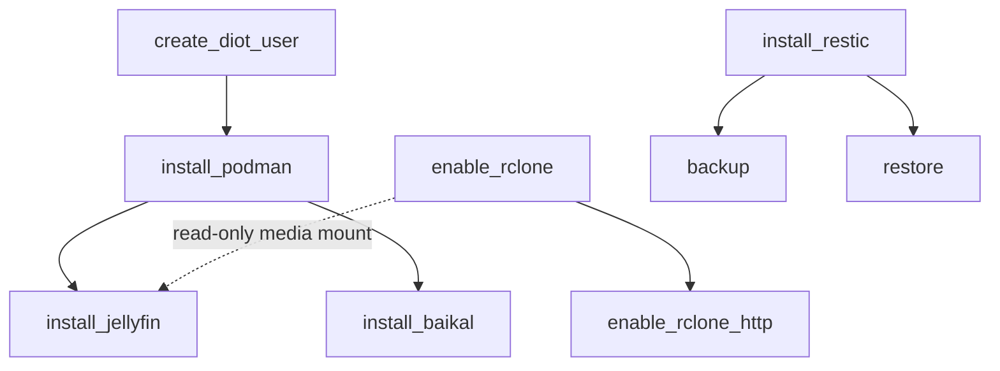

# strata

A small Ansible config manager for provisioning a personal Linux machine. Playbooks do the work; a thin Python layer (`ansible-runner` plus a `strata` CLI) wraps them so that prerequisites -- sudo passwords, vault secrets, SSH keys, system users, data directories -- are resolved declaratively before a playbook runs, prompting only when something is genuinely missing.

The managed host defaults to the local machine itself (`ansible_connection=local`), so the controller and the target are usually the same box -- which is why interactive prompts (vault password, rclone authorization) work directly during a run. Additional machines can be registered with `strata device add` and targeted with `--target <hostname>`.

## Layout

The package is a three-layer scaffold, and an import-linter contract enforces it: `cli`, `adapters` and `core` are the only top-level packages, and imports may only point downward (`cli` -> `adapters` -> `core`).

- `strata/cli/` -- the `strata` CLI entrypoint (Typer) and the composition root: `main.py` assembles the app tree, `commands/` holds one module per command group, `dispatch.py` resolves and runs a runbook.
- `strata/core/` -- runbooks, models, guards, and the `Protocol` ports adapters satisfy. No I/O. `core/runbooks/` is grouped by category (`system/`, `package_managers/`, `development/`, `infrastructure/`, `services/`); each module exposes `main(target, *, runner)` and an optional `check()`, decorated with guards that *declare* requirements rather than satisfying them.
- `strata/adapters/` -- everything that touches the outside world: `guard_executor.py` (satisfies what the guards declared, then calls `main()`), `ansible/` (runner, vault secrets, host_vars/group_vars, SSH keys, rclone, inventory), `proc.py`, `state.py`, `fs.py`.
- `ansible/playbooks/` -- the actual playbooks. Paths resolve relative to `ansible/`, independent of where the runbook module lives.
- `ansible/inventory/host_vars/<host>.yml` -- per-host plain (unencrypted) variables, e.g. rclone remotes and published SSH keys. `ansible/inventory/group_vars/all/server_apps_defaults.yml` -- shared server-app defaults. `ansible/inventory/group_vars/secrets/all.yml` -- vault-encrypted secrets (gitignored).

`docs/ARCHITECTURE.md` is the full structural reference -- the layer scaffold, the guard flow, the call chain from CLI to playbook, and the conventions a change is expected to hold to. `docs/LEDGER.md` records known asymmetries and refactor opportunities.

## Getting started

Bootstrap installs Python, pipx, uv, and the project dependencies using only the standard library:

```bash
python bootstrap.py
```

After that, everything runs through uv:

```bash
uv sync
uv run strata --help
```

The inventory is not shipped with the repository -- it names your own machines, addresses and accounts. Start from the template and edit it for your setup:

```bash
cp ansible/inventory/hosts.ini.example ansible/inventory/hosts.ini
```

The vault password is stored once in the OS keychain and reused for every encrypted secret:

```bash
uv run strata config vault-password
```

## The `strata` CLI

- `strata config var NAME [--value V]` -- set a plain variable in `group_vars/all/managed.yml`.
- `strata config secret NAME [--value V]` -- vault-encrypt a secret into `group_vars/secrets/all.yml`.
- `strata config vault-password` -- store or reset the vault master password in the keychain.
- `strata config key LABEL` -- generate an SSH keypair at `~/.ssh/<label>` and publish its public half as the `<label>_authorized_key` group var.
- `strata rclone add NAME` / `strata rclone list` / `strata rclone remove NAME` -- register rclone remotes for auto-mounting (see below).
- `strata rclone serve add NAME PATH --port PORT` / `strata rclone serve list` / `strata rclone serve remove NAME` -- register an rclone path to be served over local HTTP instead of mounted (see "Serving rclone paths over local HTTP" below).
- `strata rclone sync add NAME` / `strata rclone sync list` / `strata rclone sync remove NAME` -- register a remote whose credentials `infrastructure.sync_rclone_remote` copies onto a target host.
- `strata device add NAME --host ADDR` / `strata device list` / `strata device show NAME` / `strata device remove NAME` -- manage remote hosts in the `[remote]` group of `hosts.ini`, which `--target` then addresses.
- `strata runbook NAME [--target HOST]` -- run a runbook, e.g. `strata runbook services.install_jellyfin`. The target defaults to the last one used. Omit NAME on a terminal for an interactive picker (category first, then runbook; `← back` returns to the category list, Ctrl-C aborts), or use `strata runbook --list` to browse them as plain text. Piped/scripted invocations without a NAME still error rather than prompting.

## Guards

Guards are decorators on a runbook's `main()` that make a prerequisite hold before the body runs. They share one idea: a cheap local check, and only if it fails, do the privileged work (usually by running a small playbook).

- `@guard.prerequisite("sudo_password")` -- ensure a registered prerequisite (the vaulted sudo password) is present.
- `@guard.secret(vault_key, ...)` -- ensure a vault secret exists, prompting (and optionally generating) if absent.
- `@guard.user(name, playbook)` -- ensure a system user exists, running `playbook` to create it if not.
- `@guard.path(path, owner=, group=, mode=)` -- ensure a local filesystem path exists with the given ownership and mode, delegating to `ensure_path.yml`.
- `@guard.mount(remote:subpath)` -- ensure an rclone remote is registered and its mount point is live (creating the remote interactively if missing), running `enable_rclone.yml` if not.
- `@guard.storage(vault_key, owner=, group=, mode=, require_writable=)` -- ensure a vaulted storage location -- prompted for like `@guard.secret` -- is ready, dispatching to the `@guard.path` or `@guard.mount` flow at runtime depending on whether the stored value is a local path or a `remote:subpath`.
- `@guard.requires("category.runbook")` -- ensure an upstream runbook has run first.
- `@guard.controller_only(reason)` -- refuse a non-controller target outright, for workstation tooling whose playbook is deliberately `hosts: local`. Without it such a play matches no hosts under `--limit`, which ansible reports as success.
- `@guard.backup_tag(tag, path)` -- declare that `path` is snapshotted under restic tag `tag`; `infrastructure.backup` collects these by importing every runbook.
- `@guard.alias(display_name)` -- the friendly name shown in `--list` and the picker. Metadata only; a runbook is still invoked by its dotted or leaf name.

## System and package managers

These runbooks are simpler and independent of each other (no dependency chain), so they're listed flat rather than diagrammed:

- `system.enable_security_autoupdates` -- enable automatic security updates via unattended-upgrades.
- `package_managers.install_flatpak` -- install Flatpak and add the Flathub remote.
- `package_managers.install_homebrew` -- install Homebrew and core dev tools (node, pipx, uv, openjdk, rust).
- `development.install_antigravity` -- install Google Antigravity CLI via the local Homebrew tap.
- `system.enable_crash_recovery` -- recover from kernel panics/freezes and keep crash evidence readable.
- `infrastructure.enable_tailscale` -- join this host to the Tailscale tailnet for off-LAN reachability.
- `infrastructure.install_restic` -- initialize the restic repository that `backup`/`restore` use.
- `infrastructure.backup` / `infrastructure.restore` -- snapshot each opted-in app's data under its own restic tag, and write the latest snapshot per tag back. Both accept `--tags` to narrow the set.
- `infrastructure.sync_rclone_remote` -- copy registered rclone remote credentials onto a target host.
- `services.install_from_git` -- install CLI apps from local git repos via pipx, driven by a hand-edited list in `static/git_apps.toml`. Runs `pipx install <repo>` for each listed app (uninstall first for a clean rebuild every run). Guarded by `@guard.requires("package_managers.install_homebrew")` since homebrew provides pipx.

## Server apps

Server apps run as rootless Podman containers owned by a dedicated `diot` user (a container operator with a subuid/subgid range and systemd lingering, so its `--user` services persist without a login). Each container is a Quadlet unit under `~diot/.config/containers/systemd/`, which systemd turns into a managed service.

The dependency chain is enforced by guards, so running a leaf runbook pulls in everything beneath it:



- `install_podman` -- Podman and the rootless toolchain; ensures `diot` via `create_diot_user`.
- `enable_rclone` -- install rclone and mount configured remotes (see below).
- `enable_rclone_http` -- serve registered rclone paths over local HTTP instead of mounting them (see "Serving rclone paths over local HTTP" below).
- `install_jellyfin` -- Jellyfin media server on port 8096; config and cache at `/srv/jellyfin/{config,cache}` (`diot:jellyfin`, setgid), with the read-only media library bound from `/mnt/rclone/pcloud/Media`.
- `install_baikal` -- Baikal CalDAV/CardDAV server on port 8080; data at `/srv/baikal/{config,Specific}` (`diot:baikal`, setgid).

## rclone mounts

`enable_rclone` mounts registered cloud-storage remotes under `diot`, one `systemd --user` FUSE mount per remote at `/mnt/rclone/<name>` (the remote root). Mounts are read-only unless the remote was registered with `strata rclone add --writable`, which a runbook needing a write destination (e.g. a restic repository) requires. Credentials come from rclone's own config file -- the project never touches them. The registered remote list lives in `group_vars/all/managed.yml` as `rclone_remotes`, with the writable subset in `rclone_writable_remotes`. The runbook is declarative: it prunes units for remotes you have removed from the list.

Mountpoints are under `/mnt/rclone/` which the `fusermount3` AppArmor profile permits for unprivileged FUSE mounts. Sub-paths within a mount are addressed with `remote:subpath` notation (e.g. `pcloud:Media`) and resolved to local paths (e.g. `/mnt/rclone/pcloud/Media`) by `rclone.resolve()` and `guard.mount`.

Authorize a remote directly with rclone, then register it:

```bash
rclone config create pcloud pcloud          # browser OAuth -- run once as yourself
strata rclone add pcloud                    # records 'pcloud' in rclone_remotes
strata rclone list                          # pcloud -> /mnt/rclone/pcloud
strata runbook infrastructure.enable_rclone   # copies rclone.conf to diot, starts mount unit
```

## Jellyfin media pipeline

Jellyfin reads its library from `/mnt/rclone/pcloud/Media` (a subpath of the pcloud root mount). The Jellyfin Quadlet declares `RequiresMountsFor=/mnt/rclone/pcloud/Media` so systemd holds the service until that path is actually mounted. It does not use `BindsTo=rclone-pcloud.service`: Jellyfin runs as a diot *user* unit and the mount is a *system* unit, and a user unit cannot order against a system one.

A rootless container captures its bind mounts at start time in its own mount namespace, so the rclone mount must be live when the Jellyfin container starts. The setup order:

1. Authorize and register pcloud (see above) and run `enable_rclone`.
1. `strata runbook services.install_jellyfin` -- `guard.mount("pcloud:Media")` verifies the mount is live, then the playbook binds `/mnt/rclone/pcloud/Media` into the container at `/media:ro`.

Hardware transcoding (GPU passthrough via `/dev/dri`) is not configured; Jellyfin falls back to software transcoding.

## Serving rclone paths over local HTTP

Some rclone-backed content is meant to be published, not just read locally. `rclone serve http` serves a `remote:path` over HTTP with no local FUSE mount in the loop.

Register a path and apply it:

```bash
strata rclone serve add media-store pcloud:Media --port 8083
strata runbook infrastructure.enable_rclone_http
```

This writes a diot systemd --user service per registered entry, each running `rclone serve http` bound to `127.0.0.1:<port>` only -- nothing public listens directly. Front it with a local reverse proxy if it needs to be reachable outside the machine. `--vfs-cache-mode full` is enabled (same cache flags as `enable_rclone`'s FUSE mounts), so repeat reads are served from local disk cache instead of re-fetching from the cloud backend on every request. `strata rclone serve list` lists registered entries; `strata rclone serve remove NAME` removes one (re-run the runbook to stop and prune its service).

## Secrets

Secrets are encrypted with `ansible-vault` into `group_vars/secrets/all.yml`, which is gitignored and never committed. The vault password itself lives only in the OS keychain (retrieved at playbook time by `ansible/vault_pass.py`). Private SSH keys stay in `~/.ssh`; only public halves are published to group vars. Never hard-code a credential in a playbook -- declare it with `@guard.secret` and let the guard seed it into the vault. (SSH keypairs are not guards -- they are created out of band with `strata config key`.)

## Not yet automated

Provisioning steps that are still done by hand -- no runbook covers these yet. Lifted
from the pre-project `docs/TODO` checklist when that file was retired; everything else
on it has either shipped or was made obsolete by a later change.

- Remove Snap and the Ubuntu App Store.
- Install `libfuse2`, `fuse`, and `pcscd`.
- Install Bitwarden and Firefox (via Flatpak -- `package_managers.install_flatpak` sets
  up Flathub, but installs no apps).
- Install AppImageLauncher, then VSCodium and Joplin as AppImages.
- Enable SSH for a sandboxed, non-sudo account.
