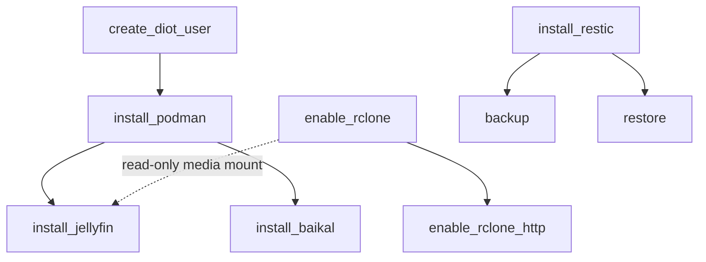

# strata Architecture

How the code is shaped: what the project is, how to run it, the layer scaffold,
the guard flow, and the conventions a change is expected to hold to.

This is the structural reference. `docs/LEDGER.md` is its counterpart -- the
running record of known asymmetries and refactor opportunities. Structure here,
open questions there; the two are deliberately not allowed to overlap, because
an earlier copy of this material lived in both places and the duplicate rotted.

## What this is

A small Ansible config manager for provisioning a personal Linux machine. Playbooks do the work; a thin Python layer (`ansible-runner` plus a `strata` CLI) wraps them so that prerequisites -- sudo passwords, vault secrets, SSH keys, system users, data directories -- are resolved declaratively before a playbook runs, prompting only when something is genuinely missing.

The managed host is the local machine itself (`ansible_connection=local`), so the controller and the target are the same box; additional remote devices can be added via `strata device add` and targeted with `--target <hostname>`.

## Commands

```bash
uv sync                       # install deps (after `python bootstrap.py`, see README)
uv run strata --help          # the CLI
uv run pytest               # full suite; runs ruff format/check, ty check, import-linter,
                              # vulture, and ast-grep as part of tests/test_lint.py (see below)
uv run pytest -m integration  # real playbooks via real ansible-runner against a
                              # disposable Podman container (needs podman +
                              # containers.podman); ~6 min, excluded by default
uv run pytest tests/unit/core/test_guard.py::test_name  # run a single test
```

Unit tests mirror the package under `tests/unit/` (e.g. `tests/unit/core/test_guard.py` covers `strata/core/guard.py`). Cross-cutting gates sit at the top level: `test_lint.py` (the lint/type gate below), `test_guard_completeness.py` (every runbook's playbook exists, its guard chain provides the tools that playbook shells out to, and its owned paths are declared *after* the guard that creates the owner), `test_feature_bindings.py` (every `features/*.feature` is either bound by a `scenarios(...)` call or explicitly tagged `@wip`; all eight are currently bound), `test_server_apps_ports.py`, `test_runbook_naming.py` (the `install_*`/`enable_*` rule plus its allowlist), and `test_alias_completeness.py` (every runbook carries a `@guard.alias` and no two aliases collide).

Linting/type-checking is not invoked separately -- `tests/test_lint.py` shells out to `ruff check`, `ruff format --check`, `ty check`, `lint-imports` (import-linter), and `vulture` and fails the suite if any report issues. `conftest.py` auto-runs `ruff check --fix` before every test session, so most lint issues self-heal on the next `pytest` run; formatting, ty, vulture, and import-linter violations still need a manual fix (`uv run ruff format .`). It deliberately does *not* auto-run `ruff format`: that ran before any test collected, so `test_ruff_format`'s `ruff format --check` only ever re-checked what the hook had just applied and could never fail. ast-grep rules live in `static/rules/`, configured via `sgconfig.yml`; `ast-grep-cli` is a declared dev dependency, so that test no longer skips.

## Layers and guard flow

Python drives Ansible: it validates prerequisites, collects secrets, and runs idempotent Ansible playbooks. Guards -- Python decorators -- enforce ordering and dependency resolution before any playbook runs.

The package follows the standard three-layer scaffold, and an `exhaustive` import-linter contract enforces it: `cli`, `adapters`, and `core` are the only top-level packages permitted, and imports may only point downward.

```text
cli  ->  adapters  ->  core
```

- `cli` -- argument parsing and wiring; the composition root, the only layer that may print or import Typer.
- `adapters` -- all I/O: ansible-runner, the vault, rclone, the inventory, subprocess, the filesystem.
- `core` -- runbooks, models, guards, and the `Protocol` ports in `core/ports.py`. No I/O, imports nothing above it.

Guards are **declarative**. A `@guard.*` decorator records a requirement on `main()` and does nothing else; `adapters/guard_executor.py` reads that list and satisfies it. This is what lets runbooks live in `core` -- declaring "this needs a vault secret" is a statement, while prompting for one is I/O.

```text
strata runbook services.install_jellyfin
  -> config.load()                          # read AppState (last_target) from XDG state dir
  -> importlib.import_module(runbook)
  -> guard_executor.execute(module, target=..., reporter=TyperReporter())
      (declared requirements, in decorator order -- outermost first)
      Prerequisite("sudo_password")          -> prompt/store sudo secret
      UpstreamRunbook("infrastructure.install_podman") -> check(), else recurse
      LocalPath("/srv/jellyfin/config", ...) -> ensure_path playbook
      LocalPath("/srv/jellyfin/cache", ...)  -> ensure_path playbook
      Mount("pcloud:Media")                  -> rclone mount check
      (first failure short-circuits; main() does not run)
  -> module.main(target=..., runner=<PlaybookRunner>)
      runner.run_playbook("install_jellyfin.yml", extravars={...}, target=target)
          -> ansible_runner.run(private_data_dir="ansible/", ...)
          -> vault_pass.py -> keyring.get_password("strata", "vault")
          -> tasks run as diot (rootless Podman) or root (system config)
      return exit_code
```

Each requirement has a cheap local check that can skip the playbook (`check()`, `_path_satisfied`, a `pwd` lookup). Those only make sense when the target *is* the controller, so they are gated on `_is_controller(target)`, which asks the inventory whether the host is `ansible_connection=local`.

- `strata/cli/` -- the `strata` CLI entrypoint (Typer). `main.py` assembles the app tree and owns only the top-level `runbook` command; each command group lives in its own module under `cli/commands/` (`config`, `rclone`, `device`, `dev`), added via `app.add_typer`. `dispatch.py` holds `run_runbook` (resolve name -> import module -> `guard_executor.execute`) and lives apart from `main.py` on purpose: `main` imports the command modules and they need to trigger runbooks, so keeping dispatch separate breaks that cycle. `picker.py` the interactive autocomplete runbook picker (a single `questionary.autocomplete` over a flat list of all runbook dotted names, with each one-line summary shown as meta) used when `strata runbook` is called without a NAME on a tty (the project's only `questionary` import site; returns `None` when stdin isn't a terminal so scripts keep erroring instead of hanging), `_helpers.py` the shared UX helpers (`not_found`, `apply_hint`), `wiring.py` the composition root. Subcommands beyond `runbook`: `config var|secret|vault-password|key`, `rclone` (`add`/`remove`/`list` + nested `serve add|remove|list` and `sync add|remove|list`), `device` (remote inventory hosts in the `[remote]` group of `hosts.ini`), and the hidden `dev` group (`dev schema` regenerates `.vscode/server_apps_schema.json` from the `ServerAppsDefaults` model -- run after changing it; `dev` is registered `hidden=True` so it stays off the operator `--help`). `strata runbook --tags` is forwarded only to runbooks whose `main()` accepts a `tags` argument (currently `infrastructure.backup` and `infrastructure.restore`).
- `strata/core/runbooks/` -- runbook modules grouped by category: `system/`, `package_managers/`, `development/`, `infrastructure/`, `services/`. Each has `main(target, *, runner: PlaybookRunner) -> int` and an optional `check() -> bool`, decorated with guards. Adapters arrive by injection: the executor inspects the signature and supplies `runner`, `secrets`, `apps`, or `reporter` as declared. Runbooks are not standalone scripts -- always invoke them via `strata runbook <name> --target <host>`.
- `strata/core/guard.py` -- the decorators: `@prerequisite`, `@secret`, `@user`, `@path` (local filesystem), `@mount` (rclone `remote:subpath`), `@storage` (vaulted location that may be either, dispatched at runtime), `@requires` (an upstream runbook), `@controller_only(reason)` (refuses a non-controller target, for the workstation playbooks that are deliberately `hosts: local`), `@backup_tag(tag, path)` (declares that `path` is backed up under a restic tag). Each records a `core/requirements.py` dataclass and returns the function unwrapped. `@alias(display_name)` is the one exception: metadata only, it records no requirement and the executor never acts on it -- `discovery` reads it via `alias_of()` for the picker and `--list`, and a runbook is still invoked by its dotted/leaf name, never its alias.
- `strata/core/ports.py` -- the `Protocol` ports adapters satisfy structurally: `PlaybookRunner`, `Reporter`, `SecretReader`.
- `strata/core/paths.py` -- the single anchor for `ansible/` and `static/`. Never recompute the repo root with `Path(__file__).parents[N]`; the index silently changes when a module moves.
- `strata/core/remote_paths.py` -- pure `remote:subpath` -> local mountpoint translation (no rclone process, no filesystem).
- `strata/core/discovery.py` -- walks the runbook package to power `--list`, autocompletion, bare-leaf name resolution (`install_jellyfin` -> `services.install_jellyfin`), and "did you mean" suggestions. An unimportable runbook is skipped, not raised, so one broken module can't take the whole listing down.
- `strata/adapters/guard_executor.py` -- satisfies declared requirements, then calls `main()`. Also owns the named-prerequisite table.
- `strata/adapters/ansible/` -- Ansible integration: `runner.py` (ansible-runner wrapper, satisfies `PlaybookRunner`), `secrets.py` (vault encrypt/decrypt in-process via `ansible.parsing.vault.VaultLib`), `host_vars.py`, `group_vars.py`, `vault_pass.py`, `keys.py` (SSH keypairs), `rclone.py`, `inventory.py`.
- `strata/adapters/proc.py` -- the one place external binaries are run; resolves argv[0] to an absolute path so a missing tool names itself.
- `strata/adapters/state.py` -- `AppState` persistence (the `config.load()`/`config.save()` in the flow above), imported as `config`; reads/writes the XDG state file (`~/.local/state/strata/state.json`) and migrates forward, once, from both the pre-rename `~/.local/state/mr_manager/state.json` and the legacy repo-local `.mr_manager.json` on first load.
- `ansible/playbooks/` -- the actual playbooks, one per task. Paths resolve relative to `ansible/`, independent of where the runbook module lives. Shared task sequences live in `ansible/roles/`: `podman_quadlet_service` (write + start a diot Quadlet unit; used by `install_baikal.yml`/`install_jellyfin.yml`), `restic_container` (the restic-through-podman snapshot/restore machinery shared by `backup.yml`/`restore.yml`, keyed on `restic_action`), and `diot_systemd_units` (the reconcile cycle for a family of diot `systemd --user` units, used by `enable_rclone.yml`/`enable_rclone_http.yml`). A one-off task belongs in a flat playbook; a sequence a second caller needs belongs in a role.
- `ansible/inventory/host_vars/<host>.yml` -- per-host plain (unencrypted, committed) variables -- rclone remotes/serves, published SSH keys, the restic repository override -- written by `strata config var`/`strata config key`/rclone registration, each scoped to a `--target` host so no two hosts share a value. `ansible/inventory/group_vars/all/server_apps_defaults.yml` -- server-app settings (ports, paths, images), hand-edited and validated against the `ServerAppsDefaults` Pydantic model (`strata/core/models/server_apps_config.py`, JSON schema via `strata dev schema`); this one is a genuine shared default, so it stays in `group_vars/all/`. `ansible/inventory/group_vars/all/restic.yml` -- the restic repo-path resolution, image and config tag, shared by `backup.yml`/`restore.yml`/`install_restic.yml` (the repo-path regex used to be copied into all three). `ansible/inventory/group_vars/secrets/all.yml` -- vault-encrypted secrets (gitignored). The vault password lives only in the OS keychain (service `strata`, account `vault`; migrated forward, once, from the pre-rename `mr-manager` service name), retrieved at playbook time by `ansible/vault_pass.py`.
- `strata/core/models/` -- Pydantic models: `AppState` (`last_target`, serialized to `~/.local/state/strata/state.json` per XDG), `Device`, `ServerAppsDefaults`.
- `static/` -- non-Python assets: `git_apps.toml` (pipx-installed local git apps; currently no entries, so `services.install_from_git` short-circuits), `rules/` ast-grep lint rules, `homebrew-tools/` (the local tap consumed by `install_antigravity.yml`).

The `exhaustive` import-linter contract in `pyproject.toml` permits only `cli`/`adapters`/`core` as top-level packages and only downward imports. Adding a fourth top-level package is a contract violation, not a style preference.

## Server apps

Server apps run as rootless Podman containers owned by a dedicated `diot` user (subuid/subgid range, lingering systemd so `--user` services persist without a login). Each is a Quadlet unit under `~diot/.config/containers/systemd/`. The dependency chain (enforced by guards, so running a leaf runbook pulls in everything beneath it):



`infrastructure.backup` snapshots each app's data directory into the restic repository, one restic tag per app; apps opt in by decorating their install runbook with `@guard.backup_tag`. It also always includes a static `config` tag covering `ansible/inventory/` (host_vars, group_vars -- including the vault-encrypted secrets -- and hosts.ini), backed up/restored as root rather than diot since it's operator-owned repo config, not app data; this tag only applies on the controller (`ansible_connection=local`) and is skipped elsewhere since the path doesn't exist on remote hosts. The restic repository is resolved per host inside the playbook (a plain `group_vars/all` default plus a `host_vars` override), so runbooks must not pass a resolved repository path as an extravar. `infrastructure.restore` is the inverse: it writes the latest snapshot per tag back into each app's data directory (restic overwrites files that differ but never deletes extras); stop the app's Quadlet unit first.

See `README.md` for what each server app does, the rclone mount/serve workflows, the Jellyfin media pipeline -- that detail isn't duplicated here. `docs/LEDGER.md` is the ledger of known asymmetries and refactor opportunities -- what's worth doing, what was deliberately closed, and why. It deliberately holds nothing structural: it used to duplicate this file's directory tree, layer diagram and call chain, and those copies rotted. Structure is documented here and only here.

## Conventions and gotchas

- Never hard-code a credential in a playbook -- declare it with `@guard.secret` and let the executor seed it into the vault.
- Runbook naming: `install_*` for one-time binary/package installs, `enable_*` for services that run on a recurring basis (systemd units, mounts). A handful of runbooks are neither -- they are operations you invoke against an already-provisioned machine rather than provisioning steps -- and those are verb-named (`backup`, `restore`, `sync_rclone_remote`). `tests/test_runbook_naming.py` enforces this: a new module must use one of the two prefixes, or be added to that test's allowlist with a reason.
- Guards resolve prerequisites idempotently: prefer a cheap local check first, and only do privileged work (usually running a small playbook) if that check fails.
- Scheduled work should be a diot `systemd --user` timer, not cron (the repo currently has none). diot is the only account with lingering, which is what lets a `--user` timer fire on a headless box, and a diot unit can `Requires=` the rclone mount unit in the same user manager. Reconcile timers by including the `diot_systemd_units` role (compute desired -> find existing -> stop/disable/delete strays -> write -> flush handlers -> start) with a `.timer` template rather than re-implementing that cycle -- it already exists precisely because `enable_rclone.yml` and `enable_rclone_http.yml` each grew their own copy. Enable only the `.timer`, and never `state: started` a `Type=oneshot` service from a playbook -- that runs the job synchronously inside the ansible run.
- `tests/test_guard_completeness.py` tracks known gaps where a runbook's guard chain doesn't fully cover a playbook's real prerequisites.
